# Task Management

**Task Management** app helps you organize, prioritize, and track tasks effortlessly. Generate detailed task information with just a tap with AI. Clean interface, categories, and due dates calendar, it simple managing tasks and improving your productivity.

---
This README provides an overview of the app's features, structure, testing, and deployment processes.

---

## Quick Demo Videos & Screenshots

Below are videos and screenshots showcasing the app's functionality:

### Demo Videos
- [Quick Features Preview](https://www.youtube.com/watch?v=psUu8GVz78U&list=PL2UvDxnI-m4tkIUXoQLtd5II0dxxsdOsB&index=1) https://www.youtube.com/watch?v=psUu8GVz78U&list=PL2UvDxnI-m4tkIUXoQLtd5II0dxxsdOsB&index=1
- [Task List](https://www.youtube.com/shorts/psUu8GVz78U) https://www.youtube.com/shorts/psUu8GVz78U
- [Task Detail](https://www.youtube.com/watch?v=a8o5ctHCHt4) https://www.youtube.com/watch?v=a8o5ctHCHt4
- [Dashboard - Task Progress](https://www.youtube.com/watch?v=EbG2scD2wk8) https://www.youtube.com/watch?v=EbG2scD2wk8
- [Task Calendar Due Dates](https://www.youtube.com/watch?v=SxBNb9OsqtE) https://www.youtube.com/watch?v=SxBNb9OsqtE
- [Onboard Screens and Quick Code Review](https://www.youtube.com/watch?v=QG4QyI-XkzA) https://www.youtube.com/watch?v=QG4QyI-XkzA

### Screenshots

    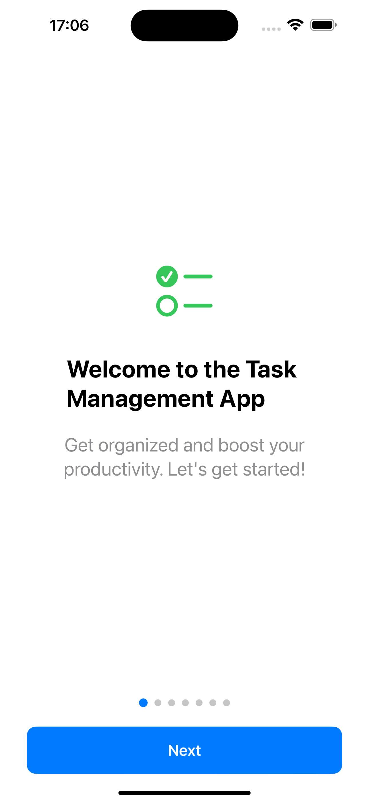
    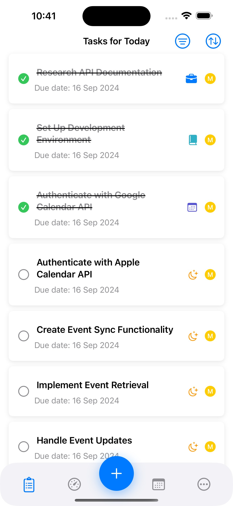
    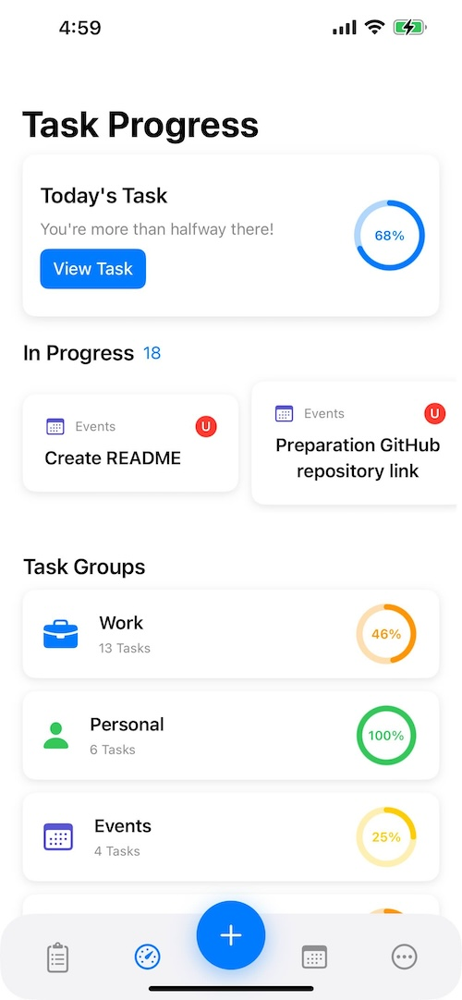
    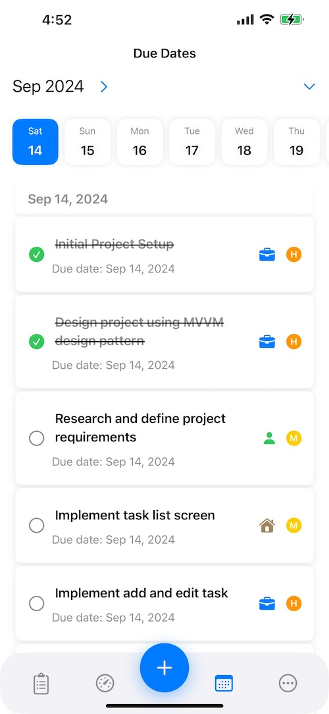
    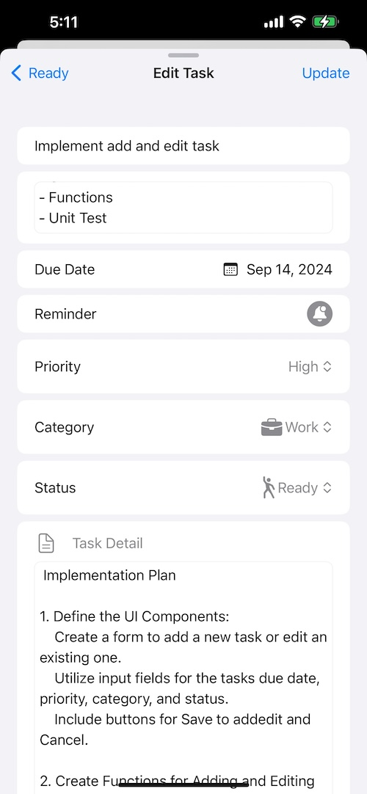
    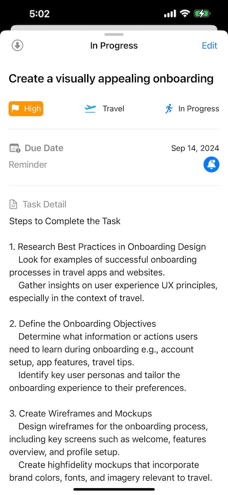
    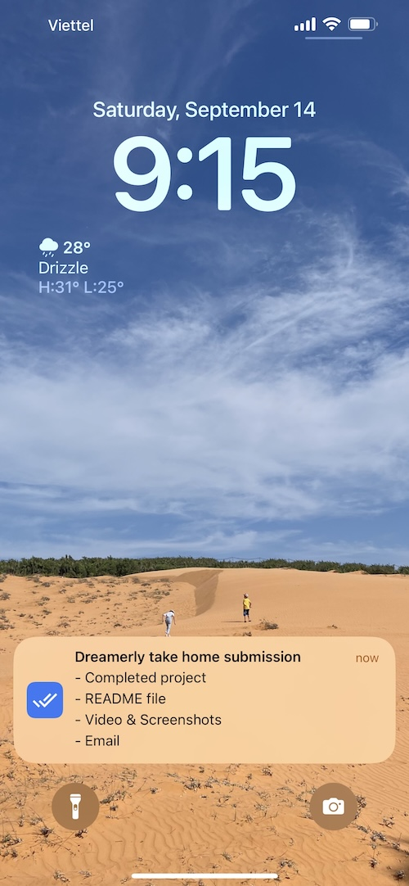
    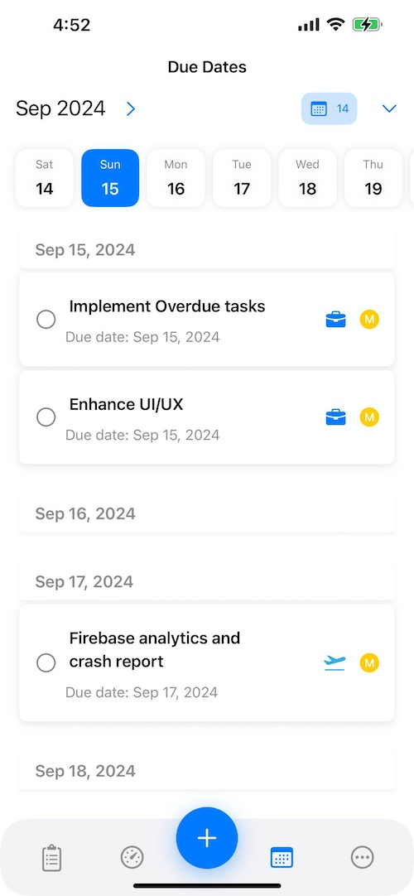
    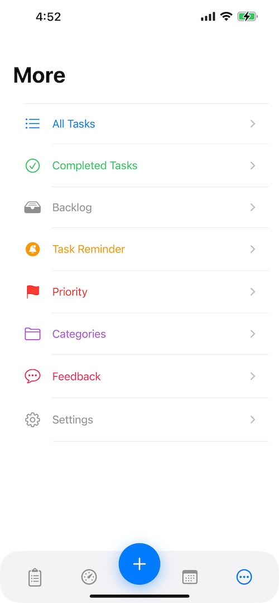

---

## Task List

The following image shows the task list used to manage the development process:

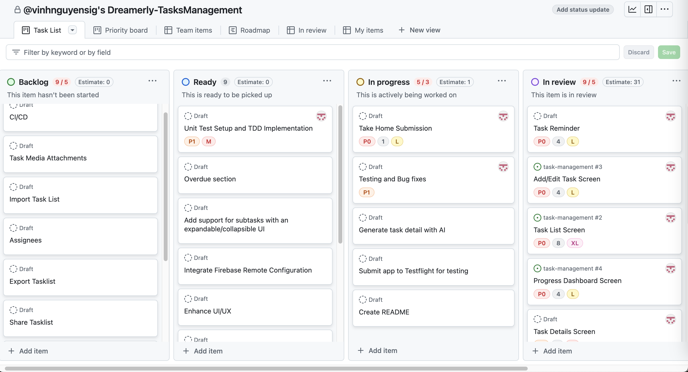

---

## App Structure

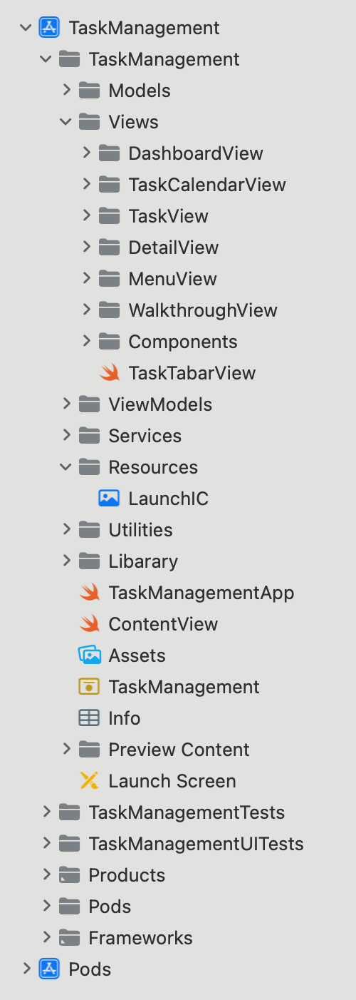

---

## Testing

### Unit Test Coverage

Extensive unit tests have been written to ensure the quality and stability of the codebase, with a focus on achieving high test coverage. If I have more time, I will write more Unit Test and UI Test

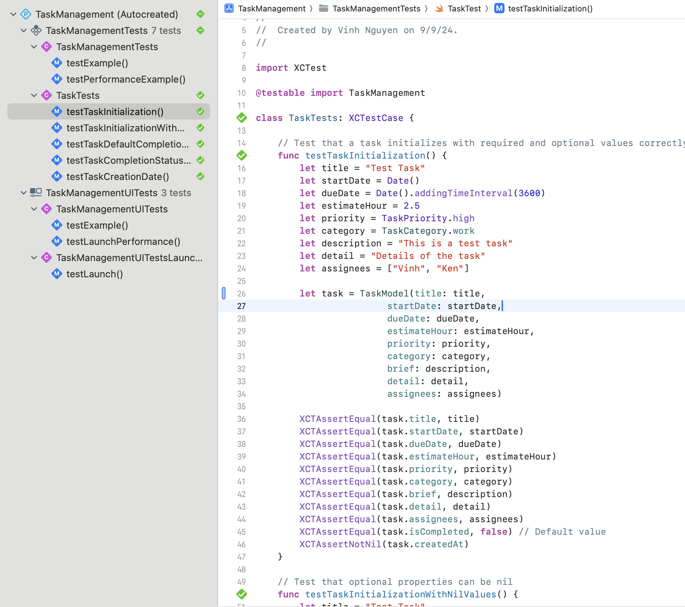

### Profile Instrument

Performance profiling was conducted to optimize the app’s efficiency:

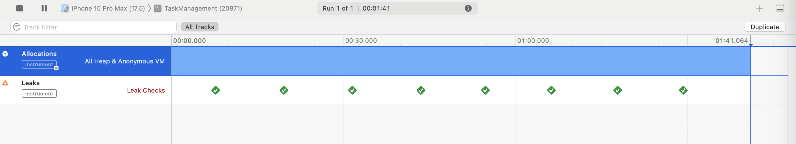

### Firebase TestLabs

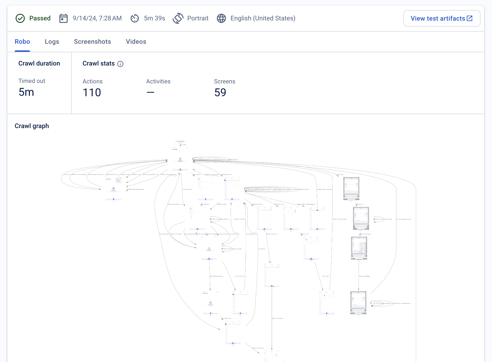
---

## Development Workflow

### Pull Requests

All code changes go through a pull request process to ensure code quality and maintainability:

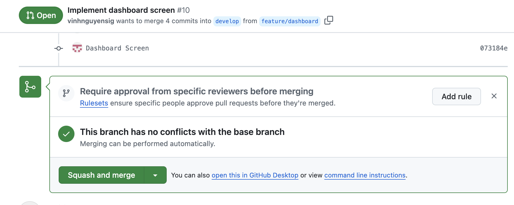

### CI/CD with GitHub Actions

The app uses GitHub Actions for continuous integration and delivery. Below is an overview of the CI pipeline:

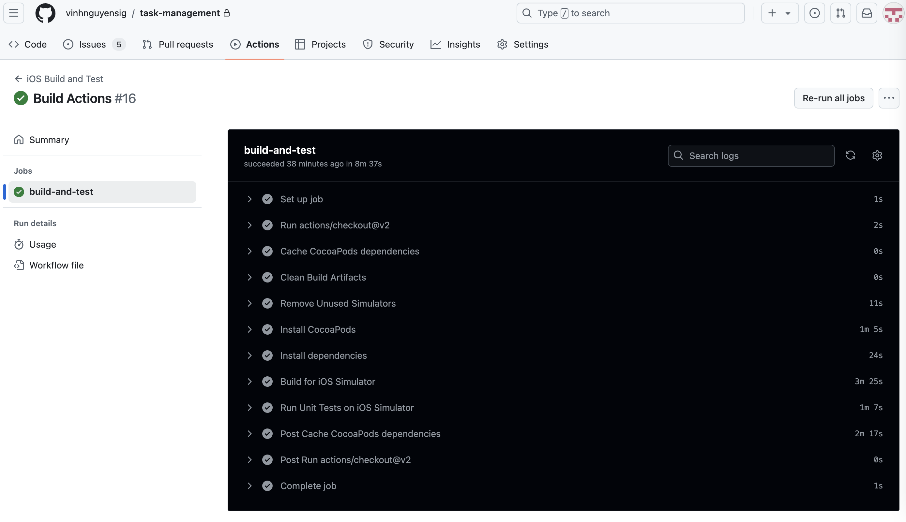

### Fastlane

Fastlane is used to automate the build and deployment process to TestFlight:

- Coming Soon...

---

## Analytics and Monitoring

### Crash Analytics

Crash analytics is integrated to monitor app performance and user issues:

- Coming Soon...

---

## Deployment

### Build TestFlight
Redeem Code: DGNXVGST

This image represents the app being built and deployed to TestFlight for testing purposes:

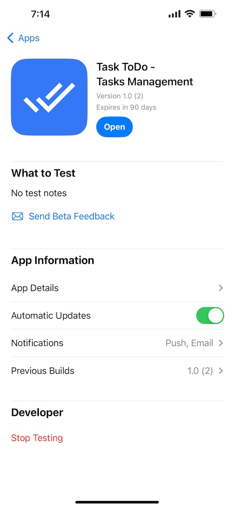

---

## Tech Stack

- **Architecture**: MVVM
- **Languages**: Swift
- **Frameworks**: SwiftUI, Combine
- **Libraries**: Alamofire, RealmSwift
- **Patterns**: Concurrency, Singleton

**Architecture: MVVM**

MVVM separates UI, business logic, and data , which makes the app more modules, maintainent and easy for unit test.

**Languages: Swift**

Safety and Performance: strong typing and handling memory automatically, which cuts down on bugs and app speed

**Frameworks: SwiftUI, Combine**

SwiftUI: Enables declarative UI design, allowing for quicker and easier development of user interfaces with less code.

Combine: reactive programming and helps manage asynchronous data streams, making it easier to bind ViewModels to the UI with automatic updates.

**Libraries: Alamofire, RealmSwift**

Alamofire: Provides a streamlined API for handling network requests, reducing code for HTTP networking.

RealmSwift: Efficient, object-oriented database that local data storage, sync and fast performance.

**Patterns: Concurrency, Singleton, KVO**

Concurrency: Swift’s async/await and Combine simplify handling asynchronous tasks, improving app responsiveness and making code more readable.

Singleton: Ensures a single instance for globally used resources, which reduces resource usage and eassyfor management.

## More Features and Enhancement

If I have more time, I will complete the tasks listed below.

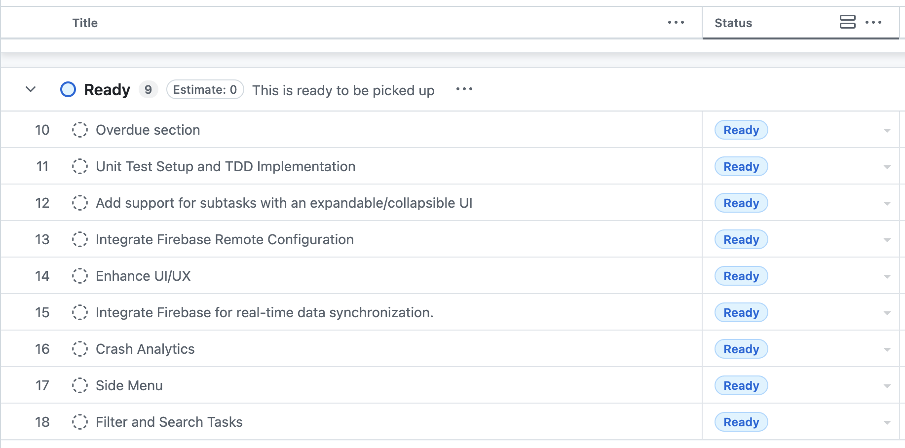
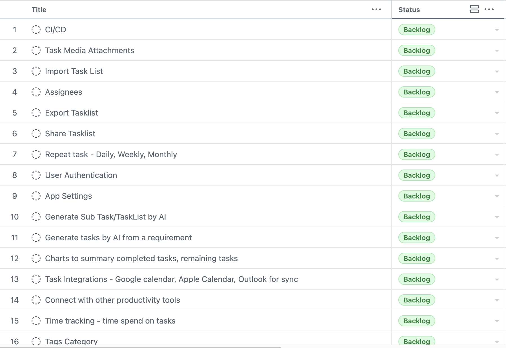
